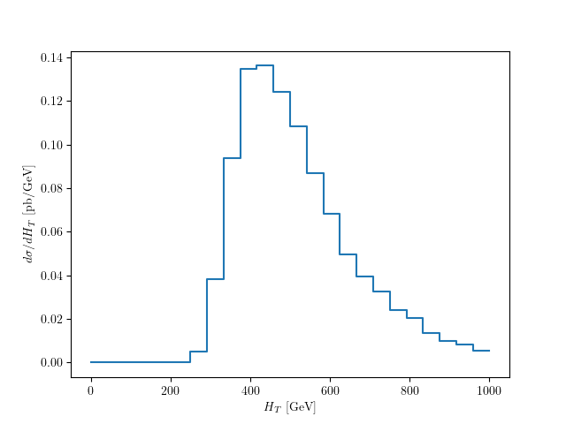
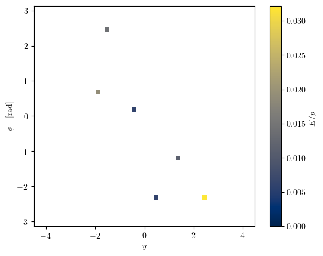
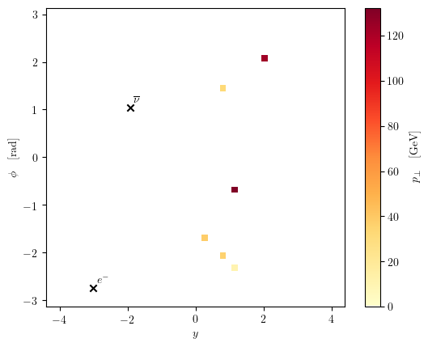
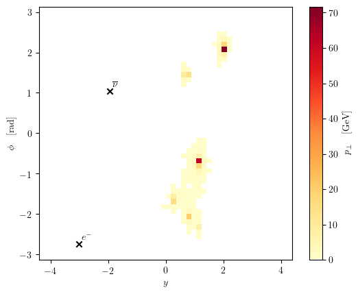

.. _exxamples-label:

==================
Usage and Examples
==================

.. contents::
   :local:
   :depth: 2

Constructing Events and Particles
=================================

The EventPlotter package can be imported to any python script as normal.

Events can be constructed from particles which require an ID (according to the
PDG database ID convention) and momentum as well as other optional parameters.

In the following snippet, we create a particle with ID 2 (an 'up'-type quark)
which is outgoing (status=1) and with a certain four momentum:

.. code-block:: python

   #!/usr/bin/env python3
   import EventPlotter as ep

   part = ep.Particle(2, status=1, px=125.233, py=40.134, pz=-315.891, e=342.17125, m=0.)

To construct events, we require an array-like container of particles and a centre
of mass energy for the interaction (currently it is assumed that the beams are
symmetric as is the case at the LHC) and an optional weight.

.. code-block:: python

   #!/usr/bin/env python3
   import EventPlotter as ep

   beam_1 = ep.Particle(2212, status=-1, px=0., py=0., pz=3.5e+03, e=3.5e+03)
   beam_2 = ep.Particle(2212, status=-1, px=0., py=0., pz=-3.5e+03, e=3.5e+03)
   in_1 = ep.Particle(3, status=-1, px=0., py=0., pz=80.387, e=80.387)
   in_2 = ep.Particle(1, status=-1, px=0., py=0., pz=-435.476, e=435.476)
   out_1 = ep.Particle(2, status=1, px=125.233, py=40.134, pz=-315.891, e=342.17125, m=0.)
   out_2 = ep.Particle(21, status=1, px=-0.469, py=1.953, pz=-4.284, e=4.731, m=0.)
   out_3 = ep.Particle(3, status=1, px=-52.286, py=-22.262, pz=-5.853, e=57.129, m=0.206)
   out_4 = ep.Particle(-12, status=1, px=-65.701, py=-41.757, pz=-38.699, e=86.936, m=0.11)
   out_5 = ep.Particle(11, status=1, px=-6.777, py=21.931, pz=9.638, e=24.896, m=0.15)

   ev = ep.Event([beam_1, beam_2, in_1, in_2, out_1, out_2, out_3, out_4, out_5], 7000.)

Events can be indexed to return the corresponding particle in the container.

The module itself is not designed to construct such events (though it does lend
itself to such an application and can easily be integrated into a Monte Carlo event
generator), and is intended to be used as an analysis tool for existing events, such
as the 2D histogram plots outlined earlier.

The Reader classes allow for the smooth reading and conversion of events in standard
formats to the formats used by the module. Events in the xml-based Les Houches format
(LHE), widely used in HEP), can be read efficiently and analysed on-the-fly.

Example - Analysis of Many Events
=================================

A routine for analysing the test LHE file provided with the unit tests for the package
is provided in the 'examples' directory:

.. literalinclude:: ../examples/lhe-analysis.py
   :language: python
   :linenos:

The main() script reads in the LHE file (line 34) and calculates the distribution of
the scalar sum of the transverse momentum (H_T in the literature) in the event sample.
Event weights are chosen to be the first in the weight vector provided with each event
in the LHE file.

The method defined on line 13 calculates the value of H_T for an event.

In main(), lines 39-46 bin the H_T values corresponding to the events and normalise the
distribution. The last lines 48-55 plot the distribution with matplotlib.

The script can be run with:

.. code-block:: bash

   $ python lhe-analysis.py

This produces the following histogram:

The scope of this functionality is clearly large; many sophisticated analyses can be run
with different distributions calculated together. Monte Carlo errors can be calculated
and plotted on the same distribution. Interfacing to `yoda <https://yoda.hepforge.org/>`_
will also allow the output of such analyses to be standardised to recognised HEP formats.

Example - Heatmap Analyses of Events
====================================

The main feature of the package - indeed the feature that inspired its creation - is the
heatmap plotting functionality. A rudimentary version of the 2D histogram plotter is
implemented in the second example:

.. literalinclude:: ../examples/plot-event.py
   :language: python
   :linenos:

This module reads the first three events from the LHE file and plots the rapidty-azimuthal
angle plane distribution of the particles in the event. The heatmap is filled according to
the user-defined function 'energy_over_perp' (line 11).

Running:

.. code-block:: bash

   $ python plot-event.py

produces three figures in the 'examples' directory corresponding to the plots. One of these
is shown below. If the title is not given to the plotting method as an argument, the figures
are shown instead of being written.

Again, the implementation above is severely limited but the scope of its applicability is
clearly vast. I have made use of this module to examine individual Monte Carlo events at
different stages of *parton shower* evolution (i.e. when the particles in the final state of
an event split, producing more particles) to explore how different algorithms produce
different distributions in this plane.

Expanding on 2D Histogram Functionality
=======================================

Additionally, with some pre-processing, this functionality can allow one to produce the
averages of events in a sample e.g.:

.. code-block:: python

   ...
   img = np.zeros((50, 50))
   for ev in events:
       l = get_image(ev)
       img += get_image(ev)/np.sum(l)

   img /= len(evolved_events)
   ...

Such functionality has been used to yield the average result of running *parton shower*
evolution on a single event many times, to calculate the overall effect of the evolution
algorithms on a starting configuration.

The input configuration is shown on the top, and the average evolved configuration is
shown on the bottom.

API Reference
=============

More complete documentation of the specific implementation of the package can be found
in the API reference, from the left-hand tab.
