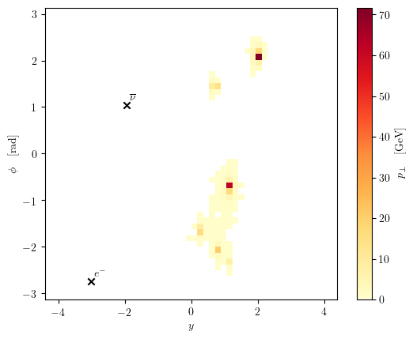

.. title::
   EventPlotter documentation

===================================================================================
EventPlotter: Comprehensive plotting and analysis of events in high energy physics
===================================================================================

.. image:: https://github.com/Hitham2496/EventPlotter/actions/workflows/tests.yml/badge.svg
   :target: https://github.com/Hitham2496/EventPlotter/

Welcome to the documentation for EventPlotter, a module created to simplify the
(often pathological) process of examining and analysing events from Monte Carlo
(MC) event generators.

This package allows the user to produce detailed plots of MC events, centered
around 2D histograms in the rapidity-azimuthal angle plane, such as the below
histogram for a W boson produced with five jets at the LHC.

Additionally, the event file reader functionality of the package enables the
user to perform robust and comprehensive analyses of large samples of events
in the standard Les Houches Event `LHE <https://inspirehep.net/literature/725284>`_
format.

The code is hosted on `GitHub <https://github.com/Hitham2496/EventPlotter/>`_
where issues may be raised. I hope to publish the package to PyPI in early 2023.

Authors
=======
This code has been contributed to by the authors listed below, and was developed
during postgraduate research at the `IPPP <https://www.ippp.dur.ac.uk/>`_, Durham
University.

`Hitham Hassan <https://github.com/Hitham2496/>`_

.. toctree::
   :maxdepth: 3
   :caption: Contents:

   setup
   examples
   autoapi/index
